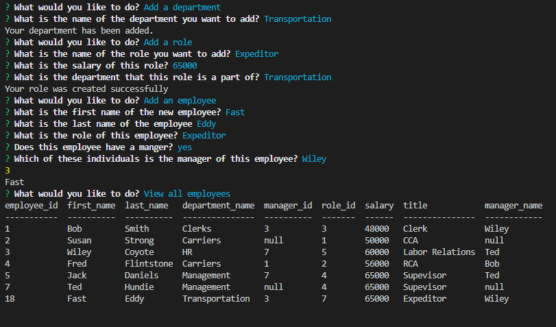

# Employee Management System

[Description](#description) 

[Installation Instructions](#installation-instructions) 

[Site Overview](#site-overview) 
  

[Contribution Guidelines](#contribution-guidelines) 

[Tests](#tests) 
 
[Questions](#questions)

## Description

This command line application is designed to make it easy for a layperson to interact with their employee database to view, add, update and delete employee information.  

The application utilizes nodeJS, inquirer, Javascript, and MySQL to store and manipulate data within the database using simple command prompts known as a Content Management System.  

## Installation Instructions

If you would like to install this application, all you need to do is clone or fork it from the repository listed at the top of this page.  Once you have it on your local device, you can run a NPM install to ensure that all of the node modules are functional.  Then, simply start the application with an npm start.  

## Site Overview

[Click here to see a full video overview of the application!](https://drive.google.com/file/d/1FA9LCpWn5Go5psC1GY8sUNtSixrSscA0/view)

The first thing you will be greeted by when you open this application is a banner message informing you that this is an Employee Management System and a prompt asking you what you would like to do.

The first thing you might want to do is view all of the existing departments, roles or employees which can be done by navigating the simple interface.

If you were to gain a new department, role, or employee, the steps to adding them into the employee management system is as easy as following a few simple prompts.  

Similarly, you can simply update an employee's role or manager by following the prompts

And if something doesn't work out with your company, you can easily delete an employee, role, or even department without harming the rest of the database.  Here is an example where the Transportation department is deleted, the CCA role is deleted, and the employee Wiley Coyote is removed.  Things don't look too good for Susan...

## License 

This application uses the MIT license

## Contribution Guidelines

If you would like to contribute to this project feel free to send requests.  I only wish that you be respectful to other contributes and to the code itself and maintain good clean coding practices. 

## Questions

If you have any questions about the application, be sure to contact me at my [e-mail](mailto:smonagha@conncoll.edu)

Alternatively you can find me and my other works at my [Github account](https://github.com/seanmonaghan)

